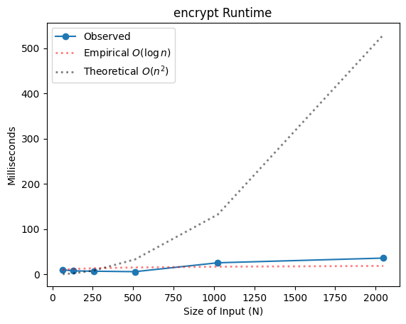

# Project Report - RSA and Primality Tests

## Baseline

### Design Experience

Jennifer Stone and I met and discussed the details of how the ModExp algorithm. We had to go back and forth a little bit before we resolved how the bases for Fermat's algorithm are selected. We also had a bit of a difficult time figuring out the time complexity of the ModExp algorithm, but eventually resolved it.

### Theoretical Analysis - Prime Number Generation

#### Time

Assume that `mod_exp(x, y, N)` is called with two `n`-bit numbers `x, N` and an unknown-length `y`. It recursively calls itself for each `y // 2` greater than 0, meaning that it will be called once for each bit in `y`. We can express `y`'s length in bits as `log(y)`. The inner body contains multiplication and modulo operations on `x`, `N`, and `z` (which is also `n`-bit, because as an output of `mod_exp` it is less than `N`) so the inner body has time complexity $O(n^2)$. Altogether, the total time complexity of `mod_exp(x, y, N)` is $O(n^2\log y)$.

In its worst case (number is prime), `fermat` generates `k` random integers `a` and tests each with `mod_exp`. Since `1 <= a <= N - 1` and the input `N` to `fermat` has `n` bits, `a` also has `n` bits, so `random.randint` has time-complexity `O(n)`. That is overshadowed by the time complexity of `mod_exp`, which is $O(n^2\log y) = O(n^3)$ (since `y` has `n` bits in this case). We can drop `k`, since it's a constant. So `fermat` has a time complexity of $O(n^3)$.

`generate_large_prime` repeatedly generates random `n`-bit numbers using `random.getrandbits` (time complexity `O(n)`) and then uses `fermat` to determine whether or not the number is prime. Because any randomly generated `n`-bit number has a $1/n$ probability of being prime, the number of times `fermat` is run scales linearly with `n`, so the overall time complexity is $O(n*n^3)=O(n^4)$.

#### Space

When called with `x, y, N` all of `n`-bits, `mod_exp` will recurse `n` times and hold up to `n` intermediate `z` values, all of `n`-bits or less. Its inner operations like multiplication and modulo have linear space complexity (multiplication of two `n`-bit numbers takes `2n` bits), so the overall space complexity is $O(n^2)$.

`fermat` has the same space complexity as `mod_exp`, since it's run `k` times in the worst case, `random.randint` has a space complexity of `n`, and so the dominating factor is `mod_exp`. Hence, the overall space complexity is $O(n^2)$.

`generate_large_prime` also has the same space complexity as `fermat`, because `random.getrandbits` has a space complexity of $O(n)$ and the result of `fermat` can be replaced on each iteration. Hence, the overall space complexity is $O(n^2)$.

### Empirical Data

| N    | time (ms)   |
| ---- | ----------- |
| 64   | 1.58        |
| 128  | 8.14575     |
| 256  | 45.73536    |
| 512  | 253.73638   |
| 1024 | 4931.42921  |
| 2048 | 51397.15338 |

### Comparison of Theoretical and Empirical Results

- Theoretical order of growth: $O(n^4)$
- Measured constant of proportionality for theoretical order: `1.0419e-08`
- Empirical order of growth (if different from theoretical): $O(n^3)$
- Measured constant of proportionality for empirical order: `3.8154e-06`

It's interesting that my theoretical and empirical results differed! My guess is that this is because of internal Python implementation details. For example, I've heard that it uses a modified algorithm internally for multiplication of large numbers with better time complexity than $O(n^2)$.

## Core

### Design Experience

Jennifer and I also did the Core design experience together. We talked about what the extended Euclid's algorithm does, and how public/private keypairs are generated. We had a nice discussion about which generated numbers are private vs. public, and whether it's really ok to consistently use a simple number like 3 as the _e_ in a public key.

### Theoretical Analysis - Key Pair Generation

#### Time

On the top level, `generate_key_pairs` runs `generate_large_prime` (time-complexity $O(n^4)$) as well as several multiplication operations (time-complexity $O(n^2)$).

It also runs `extended_euclid` a maximum of 25 times before erroring (a constant, so we can ignore it). `extended_euclid` has a time complexity of $O(n^3)$, because $a \mod b$ has one fewer bit than $a$, so there are $n$ recursions each with division operations (time complexity $O(n^2)$).

Since `generate_large_prime` dominates in complexity, `generate_key_pairs` has the same time complexity: $O(n^4)$.

#### Space

The space complexity of `extended_euclid` is $O(n^2)$, since it recurs at most $n$ times and involves the division and modulo operations (both $O(n)$ spacewise).

`generate_key_pairs` calls `generate_large_prime` twice (complexity $O(n^2)$) which outstrips the space complexity of multiplication and addition of $n$ bits ($O(n)$). It also runs `extended_euclid` a maximum of 25 times before erroring (a constant, so we can ignore it). Hence the total space complexity is $O(n^2)$.

### Empirical Data

| N    | time (ms)  |
| ---- | ---------- |
| 64   | 3.6372     |
| 128  | 20.9839    |
| 256  | 83.8757    |
| 512  | 466.5856   |
| 1024 | 5693.5294  |
| 2048 | 65829.6205 |

### Comparison of Theoretical and Empirical Results

- Theoretical order of growth: $O(n^4)$
- Measured constant of proportionality for theoretical order: `2.2682e-08`
- Empirical order of growth (if different from theoretical): $O(n^3)$
- Measured constant of proportionality for empirical order: `3.8154e-06`

Again, my theoretical and empirical results differed! This time, the results matched up even more closely with $O(n^3)$. Not quite sure why this happens, but interested to learn.

## Stretch 1

### Design Experience

I did the Design Experience with both Jennifer Stone and Cassandra! We had a nice conversation about how the command works and how the program auto-detects whether to encrypt or decrypt.

_Note: for future semesters, I think it would be less confusing to have two separate files, `encode.py` and `decode.py`._

### Theoretical Analysis - Encrypt and Decrypt

#### Time

I will treat both encryption and decryption as separate from key generation and file reading/writing. Assume that we're operating on a message that is $l$ bits long using key pairs generated with $n$ bits.

Encryption is very simple. From the public key, we get `N` ($2n$ bits) and `e` ($n$ bits). We split our input into chunks of size $2n-1$ (padding so it fits). The number of chunks scales with $O(l/n)$. Then for each chunk, output a byte with the value `mod_exp(x, e, N)`. `mod_exp` has time complexity $O(n^3)$. So the total time complexity is $O(n^2l)$. Padding, etc. have no impact on the time since they are linear. If we were to assume that $l$ is constant (as it is in our tests), we could write the time complexity as $O(n^2)$.

Decryption is similarly simple. We take chunks, this time in whole bytes, and the number of chunks scales with $O(l/n)$. Then we call `mod_exp(x, d, N)` for each chunk. Since `mod_exp` has time complexity $O(n^3)$, the total time complexity is $O(n^2l)$ or $O(n^2)$.

#### Space

Encryption and decryption both have the same space complexity. We store a certain number of chunks (scaling with $O(l/n)$), each with length proportional to $n$. The space complexity of `mod_exp` is $O(n^2)$, so the total space complexity is $O((l/n)*n*n^2) = O(ln^2) = O(n^2)$.

### Empirical Data

#### Encryption

| N    | time (ms) |
| ---- | --------- |
| 64   | 10.04291  |
| 128  | 7.70354   |
| 256  | 6.91628   |
| 512  | 5.89049   |
| 1024 | 25.55084  |
| 2048 | 35.90882  |

#### Decryption

| N    | time (ms)   |
| ---- | ----------- |
| 64   | 551.99981   |
| 128  | 869.75968   |
| 256  | 1937.14392  |
| 512  | 6284.46341  |
| 1024 | 19286.10277 |
| 2048 | 69220.04378 |

### Comparison of Theoretical and Empirical Results

#### Encryption

- Theoretical order of growth: $O(n^2)$
- Measured constant of proportionality for theoretical order: 1.5625e-04
- Empirical order of growth (if different from theoretical): $O(1)$
- Measured constant of proportionality for empirical order: 1.9831e+01

I'm really at a loss as to why empirical and theoretical results are so different. I guess it's much more efficient to process fewer chunks than larger, and this compounds with Python's built-in optimizations.

#### Decryption

- Theoretical order of growth: $O(n^2)$
- Measured constant of proportionality for theoretical order: 2.8303e-02
- Empirical order of growth (if different from theoretical): $O(n^{1.5})$
- Measured constant of proportionality for empirical order: 5.9028e-01

For decryption, empirical and theoretical results are much more similar. Not sure why.

### Encrypting and Decrypting With A Classmate

I actually did this with both Jennifer Stone and Cassandra. Jennifer's message to me was "hi" -- it worked! I wasn't able to decrypt Cassandra's message, unfortunately -- I think she had some encoding issues due to being on Windows.

## Stretch 2

### Design Experience

This design discussion, too, I did with Jennifer. We discussed how the Fermat and Miller Rabin primality tests work, and what their theoretical time and space complexities are.

### Discussion: Probabilistic Natures of Fermat and Miller Rabin

Fermat's algorithm (running with $k$ samples of $a$) is probabilistic with the following behavior:

$$
P(fermat(N) = True\ \land\ N\ \text{not prime})\leq{1\over 2^k}
$$

Unfortunately, for a rare subset of exceptions (Carmichael numbers), $fermat(N)$ will return $True$ irrespective of $k$.

To guard against such numbers, we use the Miller-Rabin primality test, which gives a probability less than or equal to $1\over 4$ of a false positive for any $a$ (without exceptions). Running with $k$ samples of $a$, we then get:

$$
P(miller\_rabin(N) = True\ \land\ N\ \text{not prime})\leq{1\over 4^k}
$$

## Project Review

I met with Jackson Gray for my project review. We discussed that we found the writeup a bit time-consuming and tedious but that the book was really helpful with providing pseudo-code and explaining time complexity.
